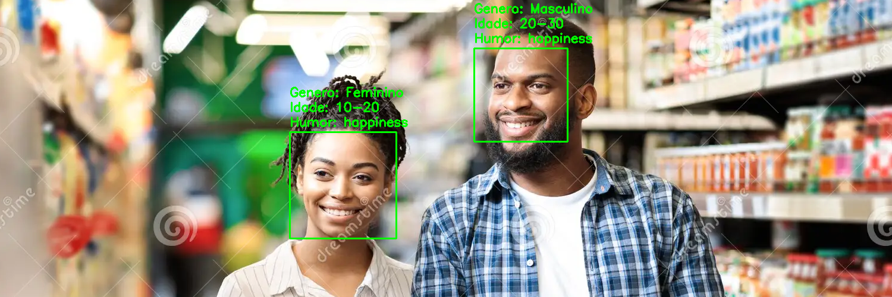
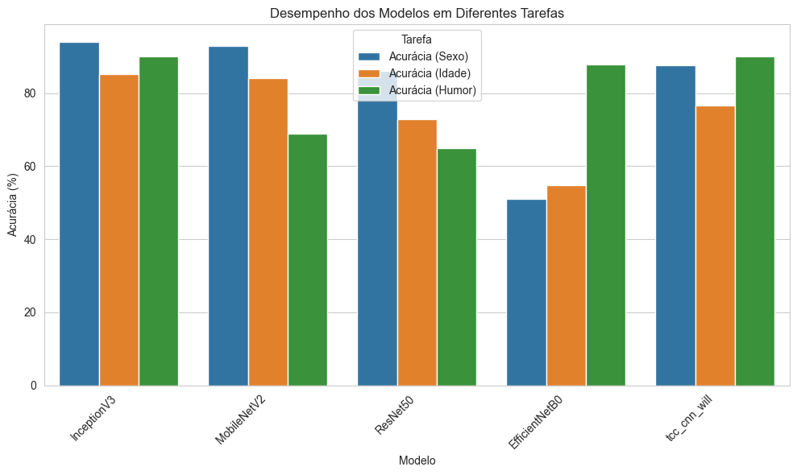
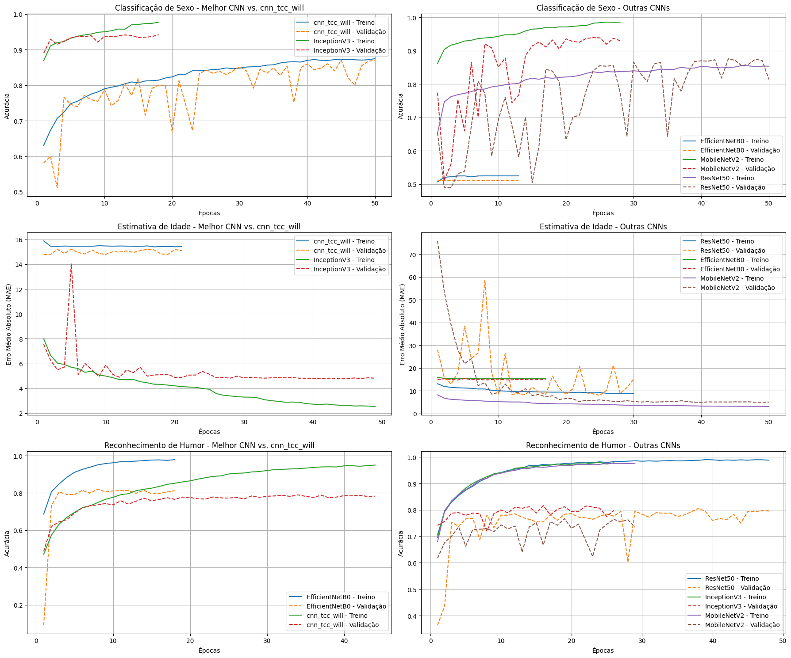
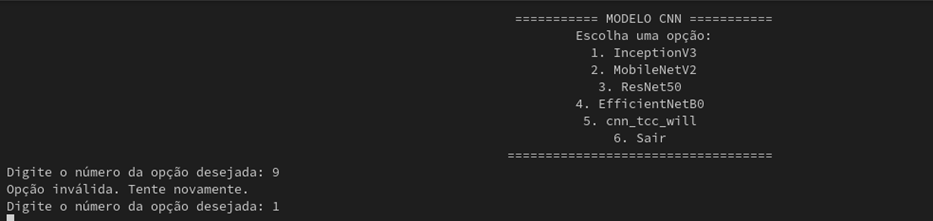
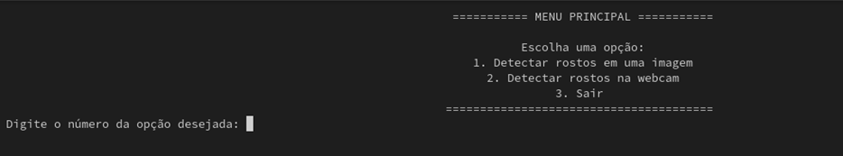
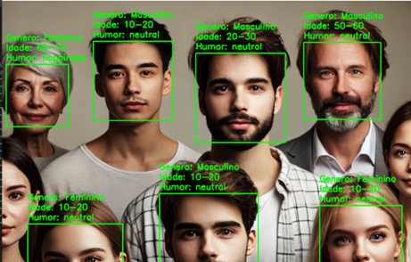

<p align="center">
    
</p>
<p align="center"><h1 align="center">Reconhecimento Facial de Sexo, Emoção e Idade com CNNs</h1></p>
<br>

## Motivação

Bem-vindo ao repositório do meu Trabalho de Conclusão de Curso (TCC)! Este projeto desenvolve algoritmos em Python para reconhecimento facial, focando na estimativa de idade, classificação de sexo e identificação de emoções por meio de Redes Neurais Convolucionais (CNNs). A abordagem utiliza três modelos distintos, cada um otimizado para uma tarefa específica, visando alta precisão e eficiência em aplicações como sistemas de segurança e marketing.

## Descrição

Desenvolvido como parte do meu TCC em Data Science e Analytics no MBA USP Esalq, este projeto explora o uso de CNNs especializadas para análise facial. Os modelos foram treinados em datasets específicos:

- **UTKFace**: Estimativa de idade e classificação de sexo.
- **CK+ (Cohn-Kanade Plus)**: Reconhecimento de emoções.
- **CelebA**: Validação visual.

## Resultados Detalhados

Abaixo estão as métricas de desempenho dos modelos avaliados:

<div align="center">

| Modelo         | Gênero (Acurácia) 🚻 | Idade (MAE) 📅 | Emoção (Acurácia) 😃 |
| -------------- | -------------------- | -------------- | -------------------- |
| InceptionV3    | 94,05%               | 4,06           | 85,19%               |
| MobileNetV2    | 93,00%               | 5,15           | 84,00%               |
| ResNet50       | 86,00%               | 9,12           | 72,75%               |
| EfficientNetB0 | 51,12%               | 15,12          | 54,82%               |
| cnn_tcc_will   | 87,64%               | 7,84           | 76,59%               |

</div>

<p align="center">
    
	
</p>

## Tecnologias Utilizadas

- Python 3.11
- TensorFlow e Keras (para CNNs)
- Jupyter Notebook (análise e visualização)
- OpenCV (processamento de imagens)
- Matplotlib e Seaborn (gráficos)

# Pré-requisitos

- Python 3.11 ou superior
- Jupyter Notebook
- Bibliotecas:
  - `tensorflow`
  - `keras`
  - `pandas`
  - `numpy`
  - `opencv-python` (para manipulação de imagens)
  - `matplotlib` (para visualizações)
  - `seaborn` (para visualizações)

## Instalação

### 1. Clone o repositorio:

```sh
❯ git clone https://github.com/limawill/reconhecimento_caracteristicas_humanas.git
```

### 2. Acesse a pasta:

```sh
❯ cd reconhecimento_caracteristicas_humanas
```

### 3. Crie um ambiente virtual:

```sh
❯ python -m venv .venv
❯ source .venv/bin/activate  # Linux/Mac
❯ venv\Scripts\activate     # Windows
```

### 4. Instale as dependências:

```sh
❯ pip install -r requirements.txt
```

### 5. Baixe os arquivos .h5:

Acesse: [Handlebars templates](http://handlebarsjs.com/) e faça download do arquivo zip. Descompacte e copie as pastas `humor`, `idade` e`sexo` para pasta `modelos`.

## Uso

- Caso queria ver executar os scripts de treinamento:

```sh
❯ jupyter notebook CNNs/tcc-idade.ipynb  # Estimativa de idade
❯ jupyter notebook CNNs/tcc-sexo.ipynb   # Classificação de sexo
❯ jupyter notebook CNNs/tcc-humor.ipynb  # Reconhecimento de emoções
```

- Detecção do rosto e estimativas de idade da lib DeepFace

```sh
❯ python deepface_rostos.py
```

- Teste de captura do rosto:

```sh
❯ python detector_rostos.py
```

- Detecção do rosto e estimativas de idade, humor e sexo:

```sh
❯ python face_detection_final.py
```

- Selecione qual CNN deseja executar:

<p align="center">

</p>

- Selecione qual tipo de entrada imagens ou video:

<p align="center">

</p>

## Exemplos de Saída

- Captura de rosto em imagens:
<p align="center">

</p>

- Captura de rosto em video (webcam):
<p align="center">

</p>

## Visão Geral da Estrutura

```sh
└── reconhecimento_caracteristicas_humanas.git/
    ├── CNNs
    │   ├── tcc-humor.ipynb
    │   ├── tcc-idade.ipynb
    │   └── tcc-sexo.ipynb
    ├── LICENSE
    ├── README.md
    ├── deepface_rostos.py
    ├── detector_rostos.py
    ├── face_detection_final.py
    ├── face_detection_with_h5_idade.py
    ├── modelos
    │   ├── humor
    │   ├── idade
    │   └── sexo
    └── requirements.txt
```

## Estrutura do Projeto

Aqui descrição do repositório e o propósito de cada arquivo/pasta:

- **`CNNs/`**: Contém os notebooks Jupyter usados no desenvolvimento e análise.
  - `tcc-humor.ipynb`: Notebook usado para treinamento e avaliação do modelo de reconhecimento de emoções.
  - `tcc-idade.ipynb`: Notebook usado para estimativa de idade com CNNs.
  - `tcc-sexo.ipynb`: Notebook usado para classificação de sexo.
- **`modelos/`**: Armazena os arquivos `.h5` dos modelos treinados.
  - `humor/`: Modelos para reconhecimento de emoções.
  - `idade/`: Modelos para estimativa de idade.
  - `sexo/`: Modelos para classificação de sexo.
- **`deepface_rostos.py`**: Script para análise facial usando a biblioteca DeepFace (primeiro estudo).
- **`detector_rostos.py`**: Script de estudo do openCV para capturar e a detecção de rostos em imagens ou vídeos.
- **`face_detection_final.py`**: Script principal para executar a detecção e classificação facial.
- **`face_detection_with_h5_idade.py`**: Script inicial para estimativa de idade usando um modelo `.h5`.
- **`requirements.txt`**: Lista de dependências do projeto.
- **`LICENSE`**: Arquivo com a licença do projeto.
- **`README.md`**: Este arquivo.

_Nota_: Os datasets (UTKFace, CK+, CelebA) não estão incluídos devido ao tamanho, mas os links para download estão no passo 5 do item Instalação.

## Limitações

Este projeto obteve resultados promissores, mas enfrentou algumas restrições:

- **Impacto de adereços**: A presença de óculos afetou a classificação de emoções, indicando sensibilidade a elementos visuais.
- **Vieses nos dados**: A classificação de gênero apresentou imprecisões em pessoas com óculos ou de etnia asiática, refletindo a necessidade de datasets mais balanceados.
- **Restrições de hardware**: O treinamento e a inferência foram limitados pelo hardware disponível e pela plataforma Kaggle, impactando a capacidade de processar arquiteturas mais profundas.
- **Resolução e qualidade**: Imagens ou vídeos de baixa qualidade podem reduzir a precisão dos modelos.

## Próximos Passos

Para evoluir este projeto, as seguintes melhorias são sugeridas:

- **Hardware mais robusto**: Usar GPUs de alto desempenho para treinar modelos mais profundos e processar vídeos em tempo real com maior eficiência.
- **Ajustes de hiperparâmetros**: Implementar taxa de aprendizado dinâmica, aumentar o tamanho do lote e adicionar regularização (ex.: dropout entre 0,3 e 0,5) para melhorar acurácia e generalização.
- **Expansão dos dados**: Incluir datasets diversificados (ex.: FairFace) e técnicas de aumento de dados para mitigar vieses e melhorar a robustez.
- **Combinação de modelos**: Integrar o `cnn_tcc_will` com modelos pré-treinados (ex.: InceptionV3) via extração de características ou ensemble para aumentar o desempenho.
- **Otimização para tempo real**: Aplicar técnicas como quantização e _pruning_ para reduzir latência e viabilizar aplicações práticas em vídeos ao vivo.

## Contribuições

- **💬 [Participe das Discussões](https://github.com/limawill/reconhecimento_caracteristicas_humanas/discussions)**: Compartilhe suas ideias, dê feedback ou faça perguntas.
- **🐛 [Reporte Problemas](https://github.com/limawill/reconhecimento_caracteristicas_humanas/issues)**: Envie bugs encontrados ou registre pedidos de novas funcionalidades para o projeto `reconhecimento_caracteristicas_humanas.git`.
- **💡 [Envie Pull Requests](https://github.com/limawill/reconhecimento_caracteristicas_humanas.git/blob/main/CONTRIBUTING.md)**: Revise PRs abertos e envie seus próprios PRs.

<details closed>
<summary>Diretrizes de Contribuição</summary>

1. **Faça um Fork do Repositório**: Comece fazendo um fork do repositório do projeto para sua conta no GitHub.
2. **Clone Localmente**: Clone o repositório forkado para sua máquina local usando um cliente Git.
   ```sh
   ❯ git clone https://github.com/limawill/reconhecimento_caracteristicas_humanas.git
   ```
3. **Crie uma Nova Branch**: Sempre trabalhe em uma nova branch, dando a ela um nome descritivo.

```sh
❯ git checkout -b nova-funcionalidade-x
```

4. **Faça Suas Alterações**: Desenvolva e teste suas mudanças localmente.
5. **Commit Suas Alterações**: Faça o commit com uma mensagem clara descrevendo suas atualizações.

```sh
❯ git commit -m 'Implementada nova funcionalidade x.'
```

6. **Envie para o GitHub**: Envie as alterações para seu repositório forkado.

```sh
❯ git push origin nova-funcionalidade-x
```

7. **Envie um Pull Request**: Crie um PR para o repositório original do projeto. Descreva claramente as mudanças e suas motivações.
8. **Revisão**: Após seu PR ser revisado e aprovado, ele será mesclado ao branch principal. Parabéns pela sua contribuição!
</details>

## Datasets

- [UTKFace](https://susanqq.github.io/UTKFace/)
- [CK+](http://www.jeffcohn.net/Resources/)
- [CelebA](http://mmlab.ie.cuhk.edu.hk/projects/CelebA.html)

## Agradecimentos

Agradeço ao meu orientador Ricardo James, à USP Esalq e ao Grok da xAI por me ajudar com este README!

## Licença

Este projeto está sob a [MIT License](https://github.com/limawill/reconhecimento_caracteristicas_humanas/blob/master/LICENSE)
